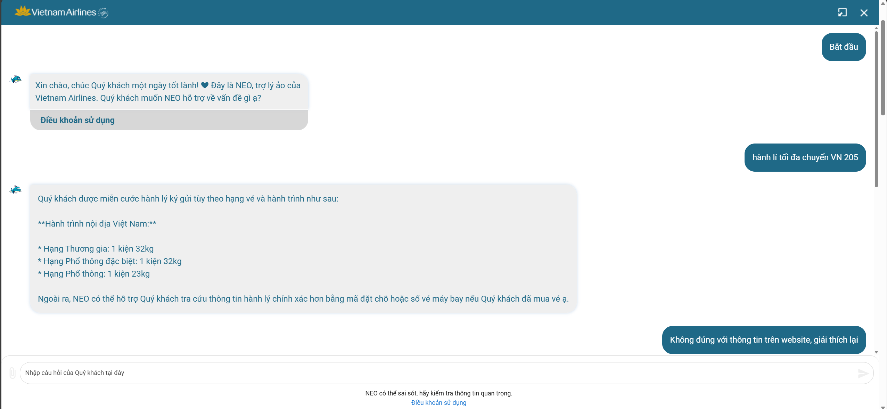
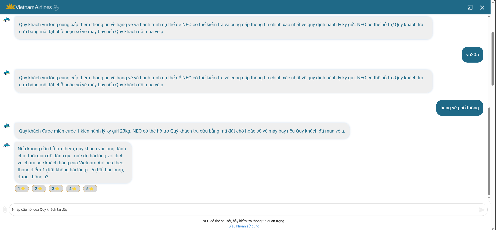

# Bài tập UX — Vietnam Airlines Chatbot NEO

**Học viên:** Hoàng Kim Trí Thành — **Mã học viên:** 2A202600372  
**Sản phẩm:** Vietnam Airlines — Chatbot NEO  
**Kênh test:** Website vietnamairlines.com (chat với NEO)  
**Ngày test:** 08/04/2026

---

## 1. Phần 1 — Khám phá (trước khi dùng & khi dùng)

**Marketing / sản phẩm hứa gì:** NEO được giới thiệu là **trợ lý ảo** hỗ trợ nhanh **tra cứu chuyến bay / vé / giá / hành lý / mua vé / hoàn đổi / check-in**; khi không trả lời được thì **chuyển tư vấn viên**. Gợi ý dùng **câu hỏi ngắn, rõ**, có thể tra theo **mục có sẵn**.

**Khi dùng thử:** mở chat, quan sát phản hồi **dạng tin nhắn**, bot đưa **khối nội dung** (bảng hành lý, nhắc mã đặt chỗ), **không thấy** UI thay đổi phức tạp (chủ yếu là luồng hội thoại). Chi tiết phiên test: transcript mục 2 bên dưới.

---

## 2. Transcript thử nghiệm (nguyên văn / tái hiện)

> **User:** Bắt đầu  
> **NEO:** Xin chào… Đây là NEO… Quý khách muốn NEO hỗ trợ về vấn đề gì ạ?  
> **User:** Điều khoản sử dụng  
> **User:** hành lí tối đa chuyến VN 205  
> **NEO:** Quý khách được miễn cước hành lý ký gửi tùy theo hạng vé và hành trình như sau:  
> **Hành trình nội địa Việt Nam:**  
> - Hạng Thương gia: 1 kiện 32kg  
> - Hạng Phổ thông đặc biệt: 1 kiện 32kg  
> - Hạng Phổ thông: 1 kiện 23kg  
> Ngoài ra, NEO có thể hỗ trợ tra cứu chính xác hơn bằng **mã đặt chỗ** hoặc **số vé máy bay** nếu Quý khách đã mua vé ạ.  
> **User:** Không đúng với thông tin trên website, giải thích lại  
> **NEO:** Quý khách vui lòng cung cấp thêm thông tin về **hạng vé** và **hành trình cụ thể**… NEO có thể hỗ trợ tra cứu bằng mã đặt chỗ hoặc số vé máy bay…  
> **User:** vn205  
> **NEO:** (lặp lại cùng yêu cầu: hạng vé, hành trình cụ thể, mã đặt chỗ / số vé)  
> **User:** hạng vé phổ thông  
> **NEO:** Quý khách được miễn cước **1 kiện hành lý ký gửi 23kg**… (và lại nhắc tra cứu bằng mã đặt chỗ / số vé).

## 2b. Hình ảnh & tài liệu — thư mục Neo_image

**Screenshot cuộc chat NEO** (bằng chứng minh họa):

**Tài liệu marketing / giới thiệu trợ lý** (tham chiếu phần gap marketing):

- File: [vietnam-airlines-neo-marketing.pdf](Neo_image/vietnam-airlines-neo-marketing.pdf) — nếu GitHub không xem được bản xem trước PDF, bấm **Download** hoặc mở link **Raw**.

---

## 3. Phân tích 4 paths

**Framework 4 paths:**

| Path | Câu hỏi (đề gốc) |
|------|------------------|
| 1. AI **đúng** | User thấy gì? Hệ thống confirm thế nào? |
| 2. AI **không chắc** | Im lặng? Hỏi lại? Show alternatives? |
| 3. AI **sai** | User biết sai bằng cách nào? Sửa bao nhiêu bước? |
| 4. User **mất tin** | Có exit? Fallback (người / manual)? Dễ tìm? |

**Áp vào phiên chat:**

| Path | Ý nghĩa | Quan sát từ đoạn chat | Nhận xét |
|------|---------|------------------------|----------|
| **1. AI đúng** | Trả lời đúng trọng tâm, user xong việc | Bot đưa bảng hành lý nội địa theo hạng; sau khi user nói **Phổ thông**, bot chốt **1 kiện ký gửi 23kg** | **Điểm mạnh:** thông tin “tier” cơ bản rõ. **Hạn chế:** user hỏi gắn **chuyến VN205** nhưng lần đầu trả lời kiểu **bảng chung**, chưa nói rõ đây là quy định chung hay đã khớp điều kiện vé/chuyến cụ thể. |
| **2. AI không chắc** | Hệ thống bộ lộ uncertainty: hỏi làm rõ / không đoán bừa | Sau phản hồi “không đúng website”, bot **xin thêm hạng vé, hành trình**, gợi ý **mã đặt chỗ / số vé** — đúng hướng | **Điểm yếu:** user gõ **vn205** (gợi ý mã chuyến) nhưng bot **không parse / không hỏi tiếp có cách hiểu nào khác**, mà **lặp lại** cùng một khối hướng dẫn → cảm giác “kẹt”, không tiến thêm vào câu trả lời theo **chuyến/vé**. |
| **3. Sai / failure** | Sai fact, hoặc “trả lời như đã chốt” dù thiếu điều kiện; khó recover | User hỏi theo **VN205**; bot đáp bằng **khung nội địa theo hạng** mà chưa chốt route/điều kiện vé của case đó | Theo góc **product failure** (không cần chứng minh sai từng kg): risk là user **áp nhận nhầm** nếu thực tế có ngoại lệ theo fare/rule. **Recover** hạn chế vì không bắt được tín hiệu “mã chuyến” từ vn205. |
| **4. Mất tin** | User nghi ngờ; cần verify / human / exit rõ | User nói thẳng **“Không đúng với thông tin trên website”** | Trong đoạn chat **chưa thấy** bước **verify nhanh** (link điều khoản hành lý, checklist 3 thông tin bắt buộc) hay **nút “Gặp tư vấn viên”** nổi bật ngay sau câu mất tin — user vẫn ở vòng “xin thêm thông tin” chung. |

**Tự phân tích (theo `02-ux-exercise.md`):**

- **Path mạnh nhất:** **Path 1** khi câu hỏi khớp **FAQ chuẩn** (bảng hành lý theo hạng; sau khi nói **Phổ thông** thì chốt **23kg**) — nội dung **có cấu trúc**, có **gợi ý bước tiếp** (mã đặt chỗ / số vé).
- **Path yếu nhất:** **Path 2** (kết hợp rủi ro **Path 3**) — có **xin thêm thông tin** nhưng **không hiểu vn205**, **lặp template**; lời đáp đầu dễ **lệch ngữ cảnh** với câu hỏi **theo chuyến**.

---

## 4. Gap marketing vs thực tế

- **Marketing / positioning:** “Trợ lý ảo”, hỗ trợ nhanh, thuận tiện; kỳ vọng ngầm là **hiểu ngữ cảnh chuyến/vé** và **giảm ma sát**.
- **Thực tế phiên test:** hành vi gần **FAQ + kịch bản cố định** — khi input không khớp pattern (vd. vn205), bot **lặp yêu cầu** thay vì **giải thích vì sao chưa thể chốt** hoặc **đề xuất bước cụ thể tiếp theo** (ngày bay, điểm đi–đến, mã đặt chỗ).
- **Gap:** Kỳ vọng “AI/trợ lý” vs trải nghiệm **rule-based** + **recovery và trust tooling** (verify + human) **chưa đủ sớm** khi user đã báo không khớp website.

---

## 5. Sketch — mô tả (ảnh kèm sketch.jpg)

**As-is (hiện tại)** — luồng ~5 bước, đánh dấu chỗ gãy (X):

1. User: “Hành lý tối đa chuyến VN205”  
2. Bot: bảng hành lý nội địa theo hạng (chung)  
3. User: “Không đúng website”  
4. Bot: xin hạng vé / hành trình / mã vé  
5. User: “vn205” → Bot **lặp lại** bước 4 → **(X) kẹt**

**To-be (đề xuất)** — luồng ~5 bước, đánh dấu cải tiện (+):

1. User: “Hành lý VN205”  
2. Bot: “Bạn muốn **(A)** quy định chung hay **(B)** theo **vé/chuyến của bạn**?”  
3. Bot: “Mình nhận mã chuyến **VN205**. Cho mình **ngày bay** hoặc **mã đặt chỗ** để chốt điều kiện vé.”  
4. Nếu user nói “không đúng website”: hiện ngay **Link chính sách hành lý** + **Gặp tư vấn viên** + checklist 3 mục cần có  
5. Trả lời chốt theo điều kiện **hoặc** đã chuyển người → **(+) xong việc**

**Phần 3 đề bài — Thêm / bớt / đổi (trên sketch giấy):**

- **Thêm:** nhánh **Chung vs Theo vé**; bước **nhận diện mã chuyến** + xin **ngày bay / mã đặt chỗ**; **link chính sách** + **gặp tư vấn viên** ngay khi user báo sai so với web.
- **Bớt:** vòng **lặp** cùng một khối “xin hạng + hành trình” khi user đã cố đưa **VN205**.
- **Đổi:** từ **trả lời khung chung ngay** sang **nói rõ đây là quy định chung** (nếu chưa có vé) hoặc **đi thẳng tra theo vé**.

---

## 6. Kết luận ngắn (30 giây khi trình bày)

NEO xử lý tốt kiểu **câu hỏi tier chuẩn**, nhưng với câu hỏi **gắn mã chuyến**, luồng dễ **lệch ngữ cảnh** rồi **lặp kịch bản** khi user cố cung cấp **VN205**. Cải tiến cốt lõi: **phân nhánh chung vs theo vé**, **parse / giải thích mã chuyến**, và **verify + human handoff** ngay khi user mất tin.

---

*Bài tập cá nhân — Ngày 5 — UX workshop — Vietnam Airlines NEO*
